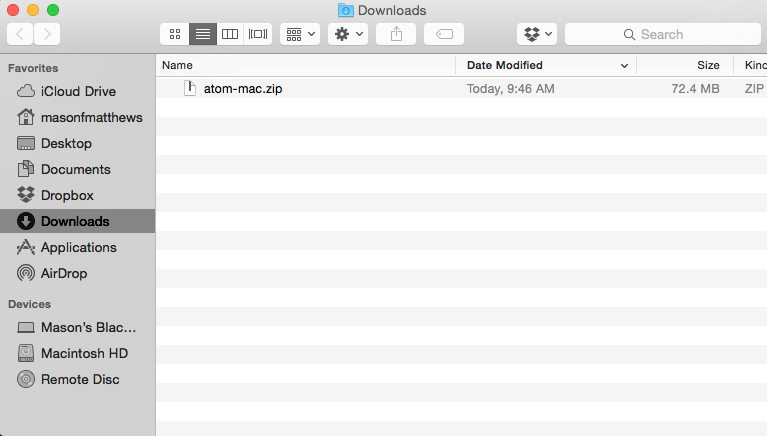

## Installing Applications on a Mac

So.  You're new to this whole Mac thing, and you've been asked to install an application.  Macs do make installs easier, but they also give you a few different options, so you need to know more than one.

### The First Thing to Know

Applications are just files.  They're files with the extension `.app`, and you double-click on them to open them.  Most of the time on a Mac, you don't truly "install" the apps.  You just have a file sitting somewhere on your machine, and you run it.  They don't usually have files spread all over the place like Windows applications.

Another nice side-effect of this approach: to uninstall an application, you just drag it to the trash can.  That's it.

### The Second Thing to Know

If you're a Windows person, you're used to downloading files from the Internet, but you've never *mounted a disk image.*  This is an odd concept, but once you've done it a few times, you get used to it.

If you download a `.dmg` file from the Internet, that's a disk image.  It's as though you froze a state  a whole disk down into a single file so that you could .  If you double-click on one of those, it will *mount* that

### Example 1: Installing Atom

Let's say you download Atom from [the Atom website](https://atom.io/).  Once you do, your downloads folder looks like this:

That's a `.zip` file.  It is a compressed set of files, and it can contain anything.  In this case, it contains a `.app` file.  Double-click on it to extract its contents.  Now you get this:

IMAGE.

To install Atom, all you have to do is drag the `Atom.app` file over to the left sidebar where it says "Applications."  That's installing the application.  You're done.

If you want to see all of your installed applications, just click on "Applications" on the left.  You can also see them by clicking on the Launchpad icon down in your dock (it looks like a rocket taking off).

Maybe you want to add it to your dock at the bottom of the screen.  The dock is this guy:

IMAGE.

From either the Applications folder or the Launchpad, you can drag an application icon down to the dock and it will stay there.  That'll make it easier for you to open it later.

### Example 2: Installing Chrome

This guy's a little different.  Not harder, but different.  When you download Chrome, you don't get a zip file.  You get a `.dmg`:

IMAGE.
